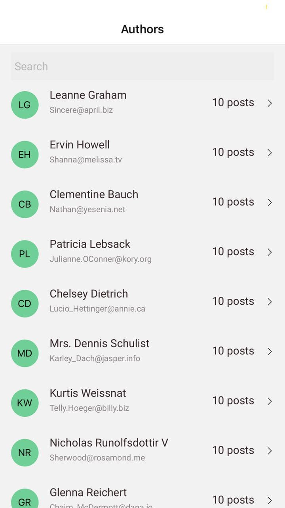
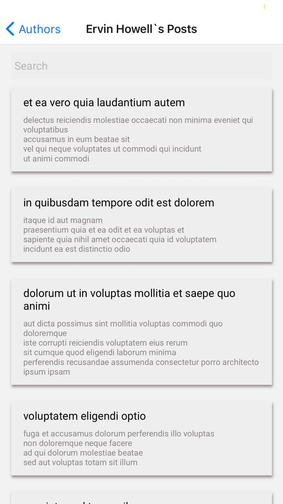

misha-react-itcraft

Getting Started
Checkout this repo, install dependencies, then start the process with the following:
- git clone https://github.com/mishap45/misha-react-itcraft.git
- cd misha-react-itcraft
- npm install
- npm start
Click download the .zip file. Extract the contents of the zip file, then open your terminal, change to the project directory, and:
- npm install
- npm start

SCREENS

Url on expo project: 
https://exp.host/@milov/mishaITCraftTestApp/index.exp?sdkVersion=39.0.0
